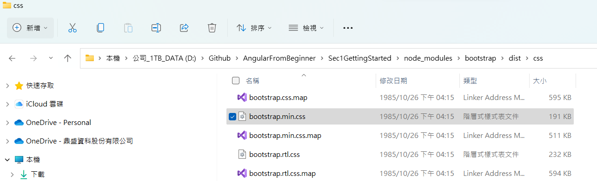
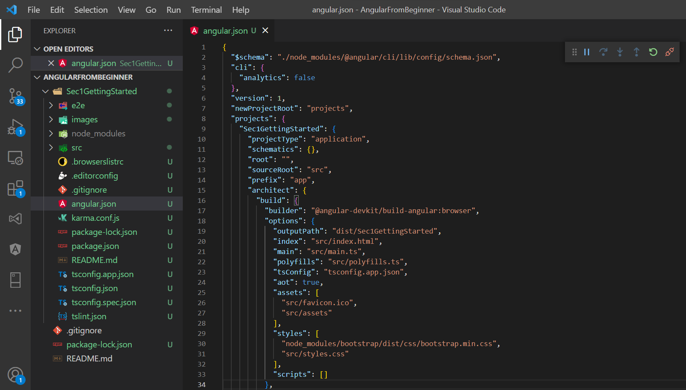
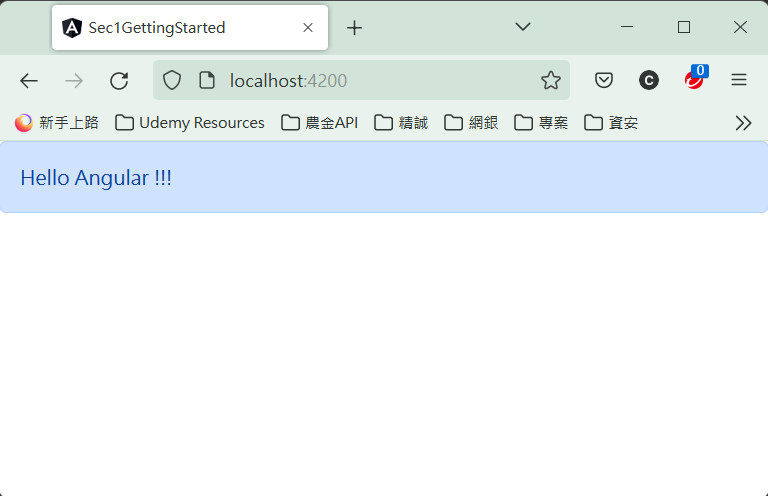

# Sec1GettingStarted

## 目標
1. 了解如何產生 Angular 專案
2. 了解如何測試 Angular 專案
3. 了解如何引用並套用 Bootstrap 樣式

## 產生專案

執行 ```ng new Sec1GettingStarted``` 命令以產生一 Angular 專案, 其餘可用預設值

## 執行專案

執行 ```ng serve``` 命令以建置 Angular 專案, 並執行測試 Web Server, 預設 port 為 4200

## 測試執行結果

打開瀏覽器, 網址列輸入 ```http://localhost:4200``` 將可以看到專案 template 所產生的頁面

## 為專案引用 bootstrap

1. 在 node_modules 下加入 bootstrap：<br/>
   使用 cmd 或 powershell，並切換到專案目錄並執行 <br/>
   ```
   npm install --save bootstrap
   ```
   所加入的 bootstrap 會在 `node-modules\bootstrap` 下
   
2. 為專案引用 bootstrap style<br/>
   使用 Visual Studio Code，開啟 angular.json，在<br/>
   ```
   projects\Sec1GettingStarted\architect\build\options\styles
   ```
   下加入
   ```
   node_modules/bootstrap/dist/css/bootstrap.min.css
   ```
   
3. 為網頁加入 bootstrap style<br/>
   開啟 src\app\app.component.html，刪除所以內容<br/>
   ```
   <div class="alert alert-primary" role="alert">Hello Angular !!!</div>
   ```
   
   會看到 Angular 會做即時編譯，如成功，在瀏覽器可以看到<br/>
   

